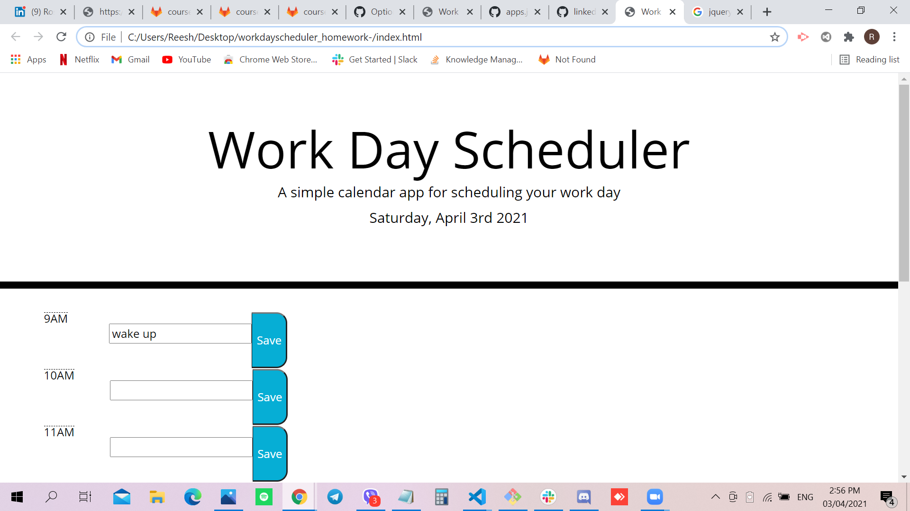

# Workday Scheduler

## Site Picture


## Technologies Used
- HTML - creates elements on the DOM
- CSS - adds style to html elements
- Javascript - adds special effects on pages
- JQuery - library for Javascript
- GitBash - for cloning repository and pushing code to GitHub
- GitHub - holds repository that deploys to GitHub Pages

## Summary
This file contains the webpage for the Workday Scheduler. It also contains code that was created using HTML, CSS, Jquery and Javascript. 

## Code Snippet
```html
var i = 9;
let updateTime = function () {
    let currentTime = moment().format('H');
    // use a for loop to get the boxes to show colors 
    for(i=9; i < 19; i++) { 
        var d = currentTime; 
        if (i==d) {
            var color = "present";
        }
        else if (i > d) {
            var color = "future";
        }
        else if (i < d) {
            var color = "past";
        } 
        var workTime = i + ":00:00";
        $(".row-" + i + " input, .row-" + i + " form").addClass(color);
        $(".row-9 > form").addClass(color); 
    }
    ```

```html
<html>

</html>
```

## Author Links 
[LinkedIn](https://www.linkedin.com/in/rosario-miranda-b81170132/)
[GitHub](https://github.com/rtmiranda18)
